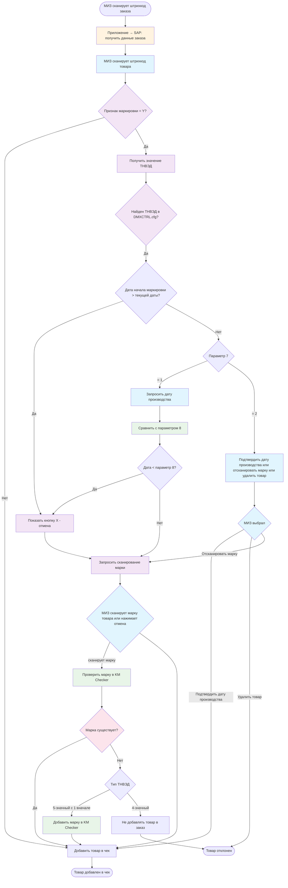

```mermaid
flowchart TD;
    StartStart(["МИЗ сканирует штрихкод заказа"]) --> GetOrder["Приложение → SAP: получить данные заказа"]
    GetOrder --> ScanProduct["МИЗ сканирует штрихкод товара"]
    ScanProduct --> CheckMark{"Признак маркировки = Y?"}
    CheckMark -- Нет --> AddToCheck["Добавить товар в чек"]
    CheckMark -- Да --> GetTNVED["Получить значение ТНВЭД"]
    GetTNVED --> SearchConfig{"Найден ТНВЭД в DMXCTRL.cfg?"}
    SearchConfig -- Да --> CheckDate{"Дата начала маркировки > текущей даты?"}
    CheckDate -- Да --> ShowDateCancel["Показать кнопку X - отмена"]
    CheckDate -- Нет --> CheckParam71{"Параметр 7"}
    CheckParam71 -- "= 1" --> RequestDate1["Запросить дату производства"]
    CheckParam71 -- "= 2" --> ConfirmDate1["Подтвердить дату производства или отсканировать марку или удалить товар"]
    RequestDate1 --> ValidateDate1["Сравнить с параметром 8"]
    ValidateDate1 --> DateCheck1{"Дата &lt; параметр 8?"}
    DateCheck1 -- Да --> ShowDateCancel
    DateCheck1 -- Нет --> RequestMarkScan["Запросить сканирование марки"]
    RequestMarkScan --> ScanMark["МИЗ сканирует марку товара или нажимает отмена"]
    ScanMark -- сканирует марку --> CheckMarkExists["Проверить марку в KM Checker"]
    CheckMarkExists --> MarkExists{"Марка существует?"}
    MarkExists -- Да --> AddToCheck
    MarkExists -- Нет --> CheckTNVEDType{"Тип ТНВЭД"}
    CheckTNVEDType -- "5-значный с 1 вначале" --> AddMark["Добавить марку в KM Checker"]
    CheckTNVEDType -- "4-значный" --> RejectProduct["Не добавлять товар в заказ"]
    AddMark --> AddToCheck
    AddToCheck --> End(["Товар добавлен в чек"])
    RejectProduct --> End2(["Товар отклонен"])
    ConfirmDate1 --> n1["МИЗ выбрал"]
    n1 -- Подтвердить дату производства --> AddToCheck
    n1 -- Удалить товар --> End2
    n1 -- Отсканировать марку --> RequestMarkScan
    ShowDateCancel --> RequestMarkScan
    ScanMark --> AddToCheck
    ScanMark@{ shape: diam}
    n1@{ shape: diam}
     GetOrder:::appSystem
     GetOrder:::sapSystem
     ScanProduct:::mizSystem
     CheckMark:::appSystem
     GetTNVED:::appSystem
     SearchConfig:::appSystem
     ShowDateCancel:::appSystem
     RequestDate1:::mizSystem
     ConfirmDate1:::mizSystem
     ValidateDate1:::backOfficeSystem
     RequestMarkScan:::appSystem
     ScanMark:::mizSystem
     CheckMarkExists:::backOfficeSystem
     MarkExists:::kmSystem
     AddMark:::backOfficeSystem
     n1:::mizSystem
    classDef mizSystem fill:#e1f5fe
    classDef appSystem fill:#f3e5f5
    classDef backOfficeSystem fill:#e8f5e8
    classDef sapSystem fill:#fff3e0
    classDef kmSystem fill:#fce4ec

```
